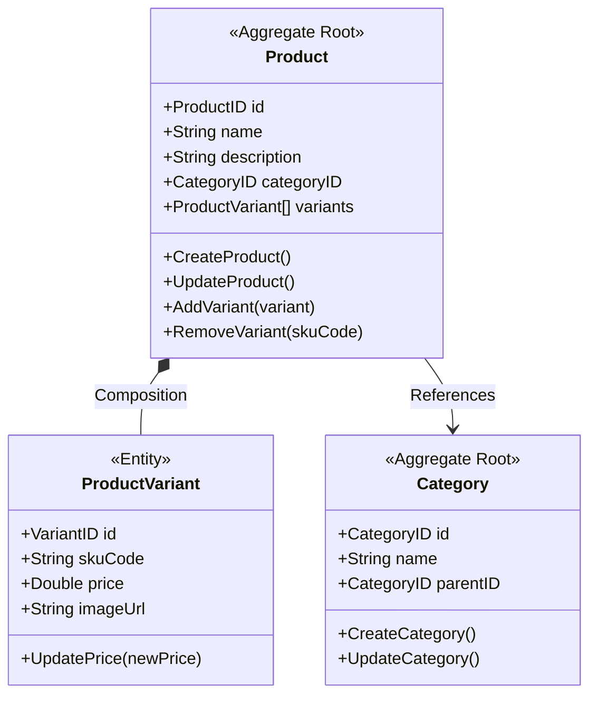

# Module: Catalog Management Bounded Context

Tài liệu này xác định ranh giới, ngôn ngữ thống nhất, mô hình miền, các luật nghiệp vụ và giao diện của **Catalog Management Bounded Context** (Ngữ cảnh Quản lý Danh mục mặt hàng).

---

## 1. Ranh giới & Mục tiêu (Boundary & Objective)

*   **Mục tiêu**: Chịu trách nhiệm quản lý cấu trúc danh mục, thông tin hiển thị sản phẩm, các biến thể sản phẩm (SKU) và giá bán tương ứng phục vụ nhu cầu tìm kiếm, duyệt web và đặt hàng.
*   **Nằm trong ranh giới (In-Scope)**:
    *   Quản lý cây danh mục sản phẩm (Categories).
    *   Quản lý thông tin chung của sản phẩm (Tên, mô tả, hãng sản xuất).
    *   Quản lý các biến thể chi tiết (SKUs) phục vụ giao dịch (Mã SKU, giá bán, hình ảnh).
*   **Nằm ngoài ranh giới (Out-of-Scope)**:
    *   Quản lý số lượng tồn kho vật lý (thuộc về Inventory Context).
    *   Quản lý giỏ hàng và đặt hàng thực tế (thuộc về Ordering Context).
    *   Khuyến mãi và mã giảm giá (Discount/Voucher Code) - sẽ được tách thành context riêng khi có yêu cầu.

---

## 2. Ngôn ngữ Thống nhất (Ubiquitous Language)

*   **Category (Danh mục)**: Phân loại sản phẩm (ví dụ: "Thiết bị điện tử", "Thời trang"). Hỗ trợ cấu trúc phân cấp (Cha - Con).
*   **Product (Sản phẩm)**: Thực thể đại diện cho một sản phẩm chung, không trực tiếp dùng để bán mà là nhóm các biến thể (ví dụ: "Điện thoại iPhone 15").
*   **Product Variant / SKU (Biến thể sản phẩm)**: Phiên bản cụ thể của sản phẩm có thể bán và giao dịch (ví dụ: "iPhone 15 - Đen - 128GB"). Mỗi SKU có mã độc nhất, giá bán và hình ảnh riêng.
*   **SKU Code**: Mã định danh duy nhất của biến thể phục vụ đối chiếu giữa các service (ví dụ: `IP15-BLK-128`).
*   **Price (Giá bán)**: Số tiền khách hàng cần trả để mua một SKU.

---

## 3. Mô hình Miền (Domain Model)

### 3.1. Aggregate Root (Gốc khối liên kết)
*   **`Product`**: Là Aggregate Root quản lý thông tin chung của sản phẩm và tất cả các biến thể (`ProductVariant`) thuộc về sản phẩm đó. Mọi thao tác thêm/bớt biến thể, điều chỉnh giá của biến thể phải đi qua Aggregate Root `Product` để đảm bảo tính toàn vẹn.
*   **`Category`**: Là một Aggregate Root độc lập, quản lý danh mục sản phẩm và mối liên hệ phân cấp cha-con.

### 3.2. Entities (Thực thể)
*   **`ProductVariant`**: Là thực thể đại diện cho biến thể của sản phẩm. Mỗi biến thể có một định danh duy nhất `VariantID` và mã `skuCode` duy nhất trên toàn hệ thống.

---

## 4. Ràng buộc & Luật Nghiệp vụ (Business Invariants)

1.  **Tính bắt buộc của dữ liệu (Not Null)**: Tất cả các trường thông tin trong `Category`, `Product`, và `ProductVariant` đều bắt buộc phải có dữ liệu (`NOT NULL`) ở mức database khi được tạo lập.
2.  **Duy nhất SKU Code**: Mã `skuCode` của mỗi biến thể sản phẩm phải là duy nhất trên toàn hệ thống (UNIQUE).
3.  **Giá trị hợp lệ của Giá bán**: Giá của mỗi biến thể sản phẩm (`price`) phải luôn lớn hơn hoặc bằng 0 (`>= 0`).
4.  **Ràng buộc Danh mục (Category Constraint)**: Một sản phẩm `Product` khi khởi tạo bắt buộc phải được gắn với một `CategoryID` đã tồn tại trong hệ thống.
5.  **Ràng buộc cấu trúc danh mục**: Danh mục cha (`parentID`) của một `Category` phải là một danh mục hợp lệ đã tồn tại và không được phép tạo liên kết vòng lặp (vòng lặp vô hạn giữa cha và con).

---

## 5. Sự kiện Miền (Domain Events)

1.  `ProductCreated`: Phát ra khi sản phẩm mới được tạo lập thành công.
2.  `SkuCreated`: Phát ra khi một biến thể sản phẩm (SKU) mới được thêm vào một sản phẩm (Chứa: `ProductID`, `VariantID`, `SkuCode`, `Price`). *Sự kiện này rất quan trọng để Inventory Context lắng nghe và khởi tạo bản ghi tồn kho.*
3.  `SkuPriceChanged`: Phát ra khi giá của một SKU thay đổi (Chứa: `SkuCode`, `OldPrice`, `NewPrice`).
4.  `ProductDeleted`: Phát ra khi sản phẩm bị xóa khỏi hệ thống.

---

## 6. Giao diện Cung cấp (API & Commands)

### Commands (Hành động thay đổi trạng thái)
*   `CreateCategory(name, parentID)` -> Tạo danh mục sản phẩm mới.
*   `CreateProduct(name, description, categoryID)` -> Khởi tạo sản phẩm mới.
*   `AddProductVariant(productID, skuCode, price, imageUrl)` -> Thêm biến thể mới vào sản phẩm (Áp dụng các luật: duy nhất `skuCode` và giá `>= 0`).
*   `UpdateSkuPrice(productID, skuCode, newPrice)` -> Cập nhật giá bán của một biến thể.
*   `DeleteProduct(productID)` -> Xóa sản phẩm và tất cả các biến thể liên quan.

### Queries (Truy vấn thông tin)
*   `GetProductDetails(productID)` -> Xem chi tiết sản phẩm và các biến thể của nó.
*   `ListProducts(categoryID, page, limit)` -> Duyệt danh sách sản phẩm theo danh mục.
*   `GetSkuDetails(skuCode)` -> Truy vấn chi tiết một biến thể phục vụ luồng Checkout/Order.

---

## 7. Quyết định Kiến trúc & Lý do (Architectural Decisions & Rationale)

1.  **Thiết kế `Product` làm Aggregate Root chứa `ProductVariant`**:
    *   *Quyết định*: Khách hàng không thể tương tác trực tiếp với một `ProductVariant` độc lập mà không thông qua sản phẩm mẹ `Product`. `Product` giữ trách nhiệm điều phối việc tạo biến thể để đảm bảo tính toàn vẹn (ví dụ: kiểm tra giá, định dạng SKU Code).
2.  **`Category` là Aggregate Root độc lập**:
    *   *Quyết định*: Danh mục được quản lý hoàn toàn độc lập với vòng đời của các sản phẩm. Việc thêm, sửa, xóa danh mục không làm ảnh hưởng trực tiếp đến trạng thái tồn tại của thực thể `Product` trong database (chỉ lưu trữ dạng ID tham chiếu mềm `categoryID`).
3.  **Lựa chọn Khóa chính cho các thực thể**:
    *   Sử dụng `CategoryID`, `ProductID`, `VariantID` là kiểu dữ liệu BigInt tự tăng (hoặc UUID) làm Primary Key cho các bảng tương ứng trong Postgres để tối ưu hiệu năng quan hệ.
