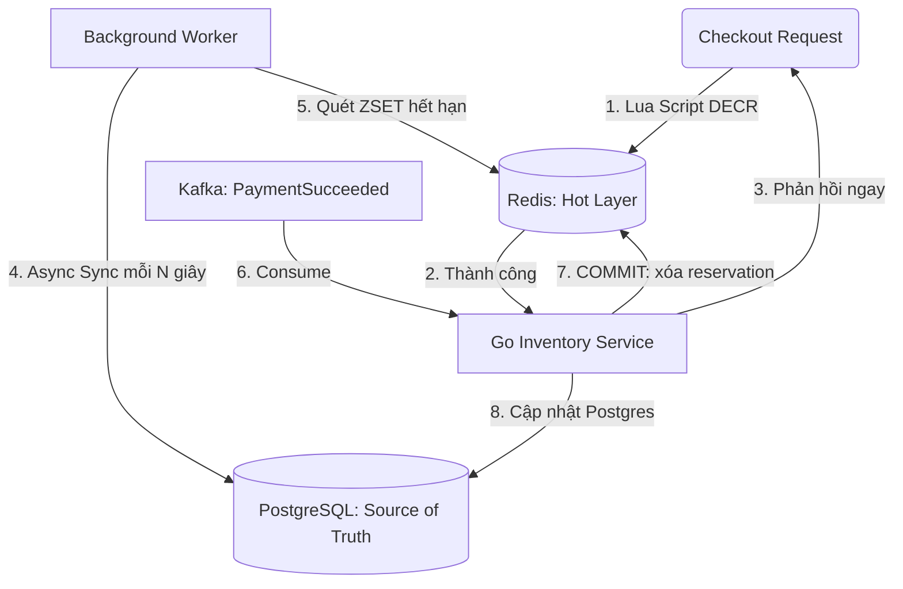

# Module: Inventory Management Bounded Context

Tài liệu này xác định ranh giới, mô hình miền, các quyết định lưu trữ và giao diện của **Inventory Management Bounded Context** (Ngữ cảnh Quản lý Kho hàng).

---

## 1. Ranh giới & Mục tiêu (Boundary & Objective)

*   **Mục tiêu**: Quản lý số lượng tồn kho khả dụng (`available_qty`) và số lượng đặt trước (`reserved_qty`) của từng SKU, đồng thời thực hiện cơ chế giữ chỗ tự động hết hạn (TTL-based Reservation) tốc độ cao phục vụ luồng mua hàng.
*   **Nằm trong ranh giới (In-Scope)**:
    *   Lưu trữ và truy vấn số lượng tồn kho khả dụng và số lượng đặt trước.
    *   Thực hiện giữ chỗ kho (Reservation) tạm thời có TTL khi khách hàng checkout.
    *   Tự động hoàn trả tồn kho khi reservation hết hạn hoặc đơn hàng bị hủy.
    *   Khấu trừ tồn kho vĩnh viễn khi đơn hàng được thanh toán thành công.
*   **Nằm ngoài ranh giới (Out-of-Scope)**:
    *   Thông tin mô tả sản phẩm, hình ảnh, giá bán (thuộc về Catalog Management Context).
    *   Quy trình đóng gói và vận chuyển thực tế (Logistics Context).

---

## 2. Ngôn ngữ Thống nhất (Ubiquitous Language)

*   **Available Quantity (Tồn kho khả dụng)**: Số lượng hàng sẵn sàng để bán tại thời điểm hiện tại.
*   **Reserved Quantity (Số lượng đặt trước)**: Số lượng hàng đang bị giữ chỗ cho các đơn hàng đang chờ thanh toán.
*   **Stock Reservation (Giữ chỗ kho)**: Hành động khóa tạm thời một số lượng hàng cho một đơn hàng cụ thể. Reservation có thời hạn (TTL = 15 phút).
*   **Stock Release (Giải phóng kho)**: Hoàn trả số lượng đặt trước về tồn kho khả dụng khi reservation hết hạn hoặc đơn hàng bị hủy.
*   **Stock Commit (Khấu trừ kho)**: Xóa bỏ reservation và giảm vĩnh viễn tồn kho khả dụng khi thanh toán thành công.

---

## 3. Kiến trúc Lưu trữ (Postgres + Redis)

### Nguyên tắc thiết kế:
1.  **PostgreSQL** là **Source of Truth** — lưu trữ trạng thái tồn kho dứt khoát và lâu dài.
2.  **Redis** là **lớp vận hành (Operational Layer)** — toàn bộ thao tác đọc/ghi trong luồng checkout đều được thực hiện trực tiếp trên Redis để đảm bảo tốc độ cao và tính nguyên tử (Atomic).
3.  **Đồng bộ async**: Background worker định kỳ đồng bộ trạng thái từ Redis về PostgreSQL.
4.  **Redis AOF**: Cấu hình `appendfsync everysec` — chấp nhận mất tối đa ~1 giây dữ liệu nếu Redis crash.



---

## 4. Mô hình dữ liệu (Data Model)

### 4.1. PostgreSQL — Source of Truth

Hai bảng lưu trữ trạng thái dứt khoát:

```sql
-- Tồn kho khả dụng theo SKU
CREATE TABLE inventory_items (
    id         BIGSERIAL PRIMARY KEY,
    sku_code   VARCHAR(100) NOT NULL UNIQUE,
    available_qty INT NOT NULL DEFAULT 0 CHECK (available_qty >= 0),
    created_at TIMESTAMP NOT NULL DEFAULT NOW(),
    updated_at TIMESTAMP NOT NULL DEFAULT NOW()
);

-- Lịch sử và trạng thái các reservation
CREATE TABLE reservations (
    id         BIGSERIAL PRIMARY KEY,
    order_id   VARCHAR(100) NOT NULL,
    sku_code   VARCHAR(100) NOT NULL,
    qty        INT NOT NULL CHECK (qty > 0),
    status     VARCHAR(20) NOT NULL DEFAULT 'PENDING', -- PENDING | COMMITTED | RELEASED
    expires_at TIMESTAMP NOT NULL,
    created_at TIMESTAMP NOT NULL DEFAULT NOW(),
    CONSTRAINT uq_order_sku UNIQUE(order_id, sku_code)
);
```

### 4.2. Redis — Operational Layer

Các cấu trúc dữ liệu Redis phục vụ luồng vận hành:

1.  **Tồn kho khả dụng** (String):
    *   Key: `inv:avail:<sku_code>`
    *   Value: `integer` — Số lượng khả dụng hiện tại.

2.  **Bản ghi giữ chỗ** (String + TTL):
    *   Key: `inv:rsv:<order_id>:<sku_code>`
    *   Value: `integer` — Số lượng đang giữ chỗ.
    *   TTL: 900 giây (15 phút).

3.  **Hàng đợi hết hạn tin cậy** (Sorted Set):
    *   Key: `inv:rsv:expire_queue`
    *   Member: `<order_id>:<sku_code>`
    *   Score: Unix timestamp thời điểm hết hạn.
    *   *Mục đích*: Đảm bảo worker không bỏ sót reservation hết hạn ngay cả khi service bị restart.

---

## 5. Các Luật Nghiệp vụ Bất biến (Business Invariants)

1.  **Không bán âm kho**: `available_qty >= 0` ở cả Redis (Lua Script kiểm tra) và Postgres (CHECK constraint).
2.  **Giữ chỗ nguyên tử**: Kiểm tra và trừ `available_qty` trên Redis phải là một thao tác nguyên tử duy nhất (Lua Script), tuyệt đối không chia thành 2 bước riêng biệt.
3.  **Reservation có thời hạn**: Mọi reservation đều phải có TTL 15 phút. Không tồn tại reservation vĩnh viễn.
4.  **Duy nhất tồn kho**: Mỗi `sku_code` chỉ có đúng một bản ghi trong bảng `inventory_items`.

---

## 6. Các luồng xử lý chính (Core Flows)

### Luồng 1: Khởi tạo Giữ chỗ (ReserveStock)

**Trigger**: Ordering Service gọi khi khách hàng checkout.

**Bước 1 — Thao tác trên Redis (Đồng bộ, tức thì):**
```lua
-- Lua Script (Atomic)
local avail_key = "inv:avail:" .. KEYS[1]
local rsv_key   = "inv:rsv:" .. KEYS[2] .. ":" .. KEYS[1]
local qty = tonumber(ARGV[1])
local ttl = tonumber(ARGV[2])  -- 900 giây

local current = tonumber(redis.call("GET", avail_key) or "0")
if current < qty then
    return 0  -- Thất bại: không đủ hàng
end

redis.call("DECRBY", avail_key, qty)
redis.call("SET", rsv_key, qty, "EX", ttl)
redis.call("ZADD", "inv:rsv:expire_queue", ARGV[3], KEYS[2] .. ":" .. KEYS[1])
-- ARGV[3] = expire_timestamp (current_unix + ttl)
return 1  -- Thành công
```

**Bước 2 — Đồng bộ về Postgres (Async, background worker):**
```sql
-- Worker ghi reservation vào Postgres
INSERT INTO reservations (order_id, sku_code, qty, status, expires_at)
VALUES ($1, $2, $3, 'PENDING', $4)
ON CONFLICT (order_id, sku_code) DO NOTHING;
```

---

### Luồng 2: Hết hạn Reservation (ExpireWorker)

**Trigger**: Background worker Go quét ZSET mỗi 5-10 giây.

```go
// Lấy các reservation đã hết hạn
expired := redis.ZRangeByScore(ctx, "inv:rsv:expire_queue",
    "-inf", strconv.FormatInt(time.Now().Unix(), 10))

for _, member := range expired {
    orderID, skuCode := parseOrderSku(member)
    qty := redis.Get(ctx, "inv:rsv:" + orderID + ":" + skuCode)
    if qty == nil { continue } // Đã bị xử lý

    // Cộng trả về Redis
    redis.IncrBy(ctx, "inv:avail:" + skuCode, qty)
    redis.Del(ctx, "inv:rsv:" + orderID + ":" + skuCode)
    redis.ZRem(ctx, "inv:rsv:expire_queue", member)

    // Cập nhật Postgres (async trong goroutine)
    go syncReleaseToDB(orderID, skuCode, qty)
}
```

```sql
-- syncReleaseToDB: cập nhật Postgres
UPDATE reservations SET status = 'RELEASED' WHERE order_id = $1 AND sku_code = $2;
UPDATE inventory_items SET available_qty = available_qty + $3,
       updated_at = NOW() WHERE sku_code = $2;
```

---

### Luồng 3: Thanh toán thành công (CommitStock)

**Trigger**: Nhận Kafka event `PaymentSucceeded`.

```go
// 1. Xóa reservation trên Redis
redis.Del(ctx, "inv:rsv:" + orderID + ":" + skuCode)
redis.ZRem(ctx, "inv:rsv:expire_queue", orderID + ":" + skuCode)

// 2. Cập nhật Postgres (đồng bộ — quan trọng)
// available_qty đã bị trừ từ bước Reserve, không trừ thêm.
// Chỉ cập nhật trạng thái reservation.
UPDATE reservations SET status = 'COMMITTED' WHERE order_id = $1 AND sku_code = $2;
```

---

### Luồng 4: Hủy đơn chủ động (ReleaseStock)

**Trigger**: Ordering Service gọi khi người dùng hủy đơn trước khi hết TTL.

```go
// 1. Lấy qty từ Redis trước khi xóa
qty := redis.Get(ctx, "inv:rsv:" + orderID + ":" + skuCode)

// 2. Cộng trả + xóa trên Redis
redis.IncrBy(ctx, "inv:avail:" + skuCode, qty)
redis.Del(ctx, "inv:rsv:" + orderID + ":" + skuCode)
redis.ZRem(ctx, "inv:rsv:expire_queue", orderID + ":" + skuCode)

// 3. Cập nhật Postgres (async)
go syncReleaseToDB(orderID, skuCode, qty)
```

---

## 7. Giao diện Cung cấp (API & Commands)

### Commands
*   `ReserveStock(orderID, skuCode, qty)` → Giữ chỗ kho (Lua Script + ZSET). Trả về `true/false`.
*   `CommitStock(orderID, skuCode)` → Xác nhận bán thành công (Kafka consumer).
*   `ReleaseStock(orderID, skuCode)` → Hoàn trả kho chủ động (khi hủy đơn).

### Queries
*   `GetAvailableQty(skuCode)` → Trả về `available_qty` hiện tại từ Redis.

---

## 8. Quyết định Kiến trúc & Lý do (Architectural Decisions)

1.  **Redis là lớp vận hành, Postgres là Source of Truth**:
    *   *Quyết định*: Thao tác checkout đánh vào Redis để đảm bảo tốc độ và tính nguyên tử. Postgres nhận đồng bộ async sau đó.
    *   *Lý do*: Redis Lua Script đảm bảo không bao giờ bán âm kho ngay cả khi hàng ngàn request đến đồng thời. Postgres lưu lịch sử dứt khoát, phục vụ audit và recovery.

2.  **AOF `everysec` thay vì `always`**:
    *   *Quyết định*: Chấp nhận mất tối đa ~1 giây dữ liệu Redis khi crash.
    *   *Lý do*: `appendfsync always` giảm throughput ~10-30%. Với TTL 15 phút và ZSET expire worker chạy mỗi 5-10 giây, rủi ro mất dữ liệu được kiểm soát ở mức chấp nhận được.

3.  **ZSET expire_queue thay vì Keyspace Notifications**:
    *   *Quyết định*: Worker quét ZSET định kỳ để phát hiện reservation hết hạn.
    *   *Lý do*: Redis Keyspace Notifications là fire-and-forget — nếu Go service bị restart đúng lúc key hết hạn, sự kiện mất vĩnh viễn. ZSET đảm bảo worker có thể xử lý bù toàn bộ reservation đã hết hạn sau khi restart.
