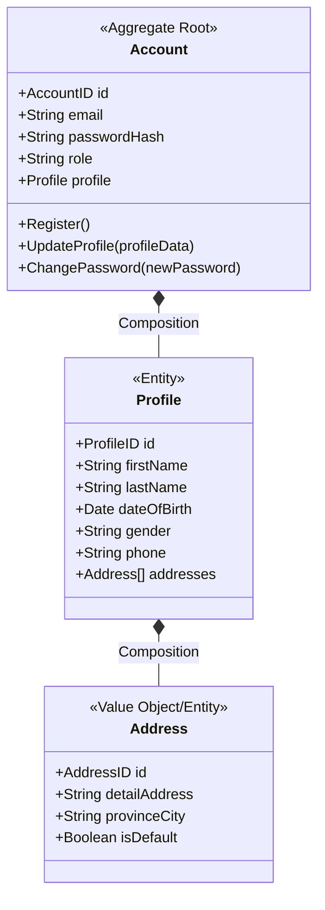

# Module: User Bounded Context

Tài liệu này xác định ranh giới, ngôn ngữ thống nhất, mô hình miền và giao diện của **User Bounded Context** (Ngữ cảnh người dùng).

---

## 1. Ranh giới & Mục tiêu (Boundary & Objective)

*   **Mục tiêu**: Chịu trách nhiệm xác thực danh tính, phân quyền và quản lý thông tin hồ sơ cá nhân cũng như sổ địa chỉ nhận hàng của người dùng.
*   **Nằm trong ranh giới (In-Scope)**:
    *   Đăng ký tài khoản, đăng nhập, cấp và thu hồi token xác thực (JWT).
    *   Quản lý thông tin cá nhân (Họ tên, số điện thoại, trạng thái hoạt động).
    *   Quản lý danh sách địa chỉ nhận hàng (Address Book) của khách hàng.
    *   Quản lý vai trò (Role/Permission) để phân quyền truy cập API.
*   **Nằm ngoài ranh giới (Out-of-Scope)**:
    *   Quản lý lịch sử mua hàng (thuộc về Ordering Context).
    *   Giỏ hàng (Shopping Cart - thuộc về Ordering Context).
    *   Lưu trữ địa chỉ giao hàng của một đơn hàng cụ thể (Ordering Context sẽ chụp ảnh tĩnh địa chỉ tại thời điểm đặt hàng).

---

## 2. Ngôn ngữ Thống nhất (Ubiquitous Language)

*   **Account (Tài khoản)**: Đối tượng chứa thông tin đăng nhập, bảo mật và phân quyền hệ thống.
*   **Profile (Hồ sơ cá nhân)**: Thông tin định danh cá nhân gắn liền với một Tài khoản.
*   **Address (Địa chỉ)**: Cấu trúc lưu trữ thông tin địa lý nơi cư trú/nhận hàng của người dùng.
*   **Email & Hashed Password**: Cặp thông tin dùng để xác thực tài khoản.
*   **Role (Vai trò)**: Quyền hạn của tài khoản (`CUSTOMER`, `ADMIN`, `WAREHOUSE_STAFF`).

---

## 3. Mô hình Miền (Domain Model)

Dưới đây là thiết kế Aggregate, Entity và Value Object cho User Context.

### 3.1. Aggregate Root (Gốc khối liên kết)
*   **`Account`**: Quản lý toàn bộ thông tin tài khoản và hồ sơ đi kèm. Mọi hành động thêm, sửa, xóa địa chỉ trong danh sách đều được thực hiện thông qua `Account`.

### 3.2. Entities (Thực thể)
*   **`Profile`**: Thực thể chứa thông tin hồ sơ của người dùng.
*   **`Address`**: Trong nghiệp vụ, địa chỉ hoạt động như một Value Object thuộc sở hữu của Profile. Tuy nhiên, để tiện cho việc cập nhật hoặc xóa một địa chỉ cụ thể trong danh sách thông qua API, mỗi địa chỉ sẽ có một định danh `AddressID` tạm thời (hoặc ID tự tăng của database).

### 3.3. Value Objects (Đối tượng giá trị)
*   **`UserRole`**: Vai trò phân quyền (`CUSTOMER`, `ADMIN`, `WAREHOUSE_STAFF`).

---

## 4. Ràng buộc & Luật Nghiệp vụ (Business Invariants)

Đây là các quy tắc nghiệp vụ bắt buộc phải được bảo toàn trong User Context:

1.  **Tính bắt buộc của dữ liệu (Not Null)**: Tất cả các trường thông tin trong các thực thể `Account`, `Profile`, và `Address` đều là `NOT NULL` (phải điền đầy đủ dữ liệu khi khởi tạo hoặc cập nhật).
    *   *Ngoại trừ*: Danh sách địa chỉ (`addresses`) của một tài khoản mới đăng ký có thể trống (`empty`) ban đầu. Nhưng một khi thêm mới một địa chỉ vào danh sách, tất cả các trường của địa chỉ đó phải `NOT NULL`.
2.  **Duy nhất Email**: Mỗi `Account` đăng ký trên hệ thống phải sử dụng một `email` duy nhất (không trùng lặp).
3.  **Giới hạn Sổ địa chỉ (Address Book Limit)**: Mỗi người dùng chỉ được lưu tối đa 10 địa chỉ nhận hàng trong danh sách `addresses`. Nếu vượt quá 10, hệ thống sẽ báo lỗi và ngăn chặn hành động thêm địa chỉ mới.
4.  **Ràng buộc địa chỉ mặc định**: Trong danh sách địa chỉ, tối đa chỉ có 1 địa chỉ được đánh dấu là `isDefault = true`. Nếu người dùng đánh dấu địa chỉ mới làm mặc định, địa chỉ mặc định cũ (nếu có) phải tự động chuyển thành `false`.

---

## 5. Sự kiện Miền (Domain Events)

1.  `AccountRegistered`: Phát ra khi tài khoản mới được đăng ký thành công (Chứa: `AccountID`, `Email`, `Role`).
2.  `UserProfileUpdated`: Phát ra khi thông tin hồ sơ cá nhân hoặc địa chỉ thay đổi (Chứa: `AccountID`, `ProfileID`, các thông tin thay đổi).
3.  `PasswordChanged`: Phát ra khi người dùng thay đổi mật khẩu thành công.

---

## 6. Giao diện Cung cấp (API & Commands)

### Commands (Hành động thay đổi trạng thái)
*   `RegisterAccount(email, password, role, profileData)` -> Đăng ký tài khoản mới kèm hồ sơ cá nhân.
*   `Login(email, password)` -> Xác thực tài khoản, cấp JWT Token.
*   `UpdateProfile(accountID, firstName, lastName, dateOfBirth, gender, phone)` -> Cập nhật thông tin hồ sơ cá nhân.
*   `AddAddress(accountID, detailAddress, provinceCity, isDefault)` -> Thêm địa chỉ mới vào danh sách (áp dụng luật giới hạn tối đa 10 địa chỉ).
*   `UpdateAddress(accountID, addressID, detailAddress, provinceCity, isDefault)` -> Cập nhật thông tin một địa chỉ cụ thể.
*   `DeleteAddress(accountID, addressID)` -> Xóa một địa chỉ khỏi danh sách.
*   `ChangePassword(accountID, oldPassword, newPassword)` -> Đổi mật khẩu tài khoản.

### Queries (Truy vấn thông tin)
*   `GetAccountDetails(accountID)` -> Trả về thông tin tài khoản bao gồm cả hồ sơ cá nhân (`Profile`) và danh sách địa chỉ (`addresses`).
*   `ValidateToken(token)` -> Xác thực Token và trả về thông tin `AccountID` + `Role`.

---

## 7. Quyết định Kiến trúc & Lý do (Architectural Decisions & Rationale)

1.  **Sử dụng Khóa chính nhân tạo (`AccountID`) thay vì `email`**:
    *   *Quyết định*: Khóa chính của bảng `accounts` là một trường tự tăng (`BigInt ID`) hoặc `UUID`. Trường `email` được gắn ràng buộc `UNIQUE` và `NOT NULL`.
    *   *Lý do*: 
        *   Cho phép người dùng thay đổi email linh hoạt mà không ảnh hưởng tới toàn vẹn khóa ngoại (Foreign Keys) ở các bảng khác (như `profiles`, `orders`).
        *   Tối ưu hóa tốc độ truy vấn và JOIN bảng (JOIN số nguyên nhanh hơn JOIN chuỗi ký tự).
        *   Nâng cao bảo mật, tránh lộ thông tin cá nhân (email) trong các logs hệ thống hoặc URL API sử dụng Khóa chính.
2.  **Sử dụng quan hệ Khóa ngoại cho danh sách địa chỉ**:
    *   *Quyết định*: Danh sách địa chỉ nhận hàng của người dùng được lưu trữ trong một bảng riêng (`addresses`) liên kết khóa ngoại `profile_id` trỏ về bảng `profiles`.
    *   *Lý do*: Phục vụ tốt nhất việc cập nhật và xóa địa chỉ cụ thể bằng `AddressID` qua API REST/gRPC và tận dụng tốt các cơ chế liên kết dữ liệu quan hệ của GORM.
