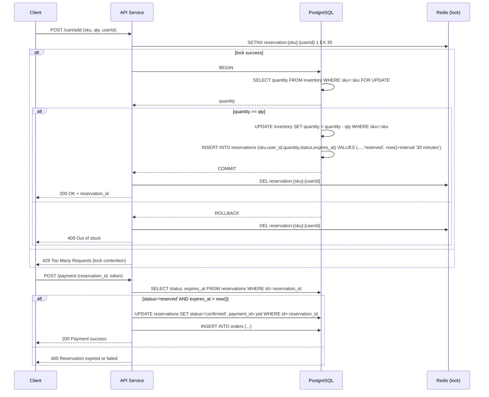

# Tổng hợp nghiên cứu flow **reservation**

## 1. Các phương pháp đặt trước (reservation) phổ biến

| Phương pháp | Cách thực hiện | Ưu điểm | Nhược điểm |
|---|---|---|---|
| Kiểm tra‑sau‑thực thi (naïve) | Đọc stock → giảm nếu >0 | Đơn giản | Rủi ro race‑condition → oversell |
| Pessimistic locking (SELECT FOR UPDATE) | Khóa hàng trong DB ở mức row | Không có oversell | Khóa kéo dài trong toàn bộ request, giảm throughput |
| Optimistic locking (cột version) | UPDATE với `WHERE version = X` | Đồng thời cao hơn | Cần vòng lặp retry, vẫn có thể abort khi contention cao |
| Atomic decrement (single SQL) | `UPDATE inventory SET quantity = quantity - :qty WHERE sku=:sku AND quantity >= :qty RETURNING quantity` | Một câu lệnh, nhanh | Không có reservation – stock mất nếu checkout thất bại |
| Reservation với TTL (Redis + cron) | Lưu key reservation trong Redis có TTL, job cron dọn sạch | Giữ hàng và timeout, dọn async | Cần cron, có thể lệch thời gian giữa Redis và DB |
| **Được chọn (hiện tại) – PostgreSQL‑only + Redis lock** | Redis `SETNX` làm lock ngắn hạn, giao dịch DB (`SELECT … FOR UPDATE`) thực hiện giảm stock và chèn reservation. Cron job giải phóng reservation hết hạn. | Đảm bảo tính toàn vẹn, không race, stack đơn giản, dễ mở rộng sang Redis cache sau. | Độ trễ hơi cao (vòng DB) và có thể xảy ra lock contention khi tải cực cao. |

## 2. Kiến trúc cuối cùng (v1)



- **Redis lock**: `SETNX reservation:{sku}:{userId} 1 EX 30` (30 giây). Nếu lock không lấy được, trả về 429 để retry.
- **Giao dịch DB**: `SELECT … FOR UPDATE` khóa hàng, sau đó giảm stock và chèn reservation. Nếu bất kỳ bước nào thất bại, `ROLLBACK` và giải phóng lock.
- **Cron job (hàng phút)** để xử lý reservation hết hạn:

```sql
BEGIN;
WITH expired AS (
  SELECT id, sku, quantity
  FROM reservations
  WHERE status = 'reserved' AND expires_at < now()
)
UPDATE inventory i
SET quantity = i.quantity + e.quantity
FROM expired e
WHERE i.sku = e.sku;
UPDATE reservations
SET status = 'expired'
WHERE status = 'reserved' AND expires_at < now();
COMMIT;
```

## 3. Khi tải tăng (Flash Sale) – mở rộng sang Redis cache

1. **Redis cache** cho `stock:{sku}` với `DECRBY` và Lua script để giảm stock đồng thời tạo reservation key.
2. **Producer → Consumer** (Redis Stream) ghi reservation vào PostgreSQL bất đồng bộ.
3. **Fallback**: nếu Redis gặp sự cố, hệ thống tự chuyển về chế độ PostgreSQL‑only đã mô tả ở trên.

> Kiến trúc hiện tại giữ PostgreSQL là **source‑of‑truth** duy nhất, Redis chỉ là **distributed lock** ngắn hạn, dễ nâng cấp sang Redis‑first khi cần hiệu năng cao hơn.
